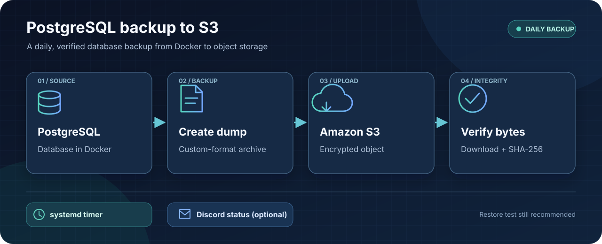

# PostgreSQL backup script



This example creates a PostgreSQL custom-format dump from a running Docker
container, validates it, uploads it to Amazon S3, and verifies the bytes that
were downloaded from S3. A systemd timer can run it once per day. CPU priority
is set to nice 10 for the service, the script, and `pg_dump`.

The backup object is stored as:

```text
s3://BUCKET/database/YYYY-DD-MM.dump
```

For example, a backup created on 27 September 2026 is stored at
`s3://example-postgres-backups/database/2026-27-09.dump`. A second successful
run on the same UTC date replaces that day's object.

The archive contains the selected database's schema and data. It does not
contain PostgreSQL cluster roles, Docker configuration, container secrets, or
files outside the database. Test a restore separately before relying on a
backup for disaster recovery.

## Requirements

The Docker host needs:

- Docker and a running PostgreSQL container.
- AWS CLI credentials available to root for unattended use.
- `flock`, `mktemp`, GNU `stat`, `sha256sum`, and `renice`.
- Python 3 only if Discord notifications are enabled.
- Enough free space for the dump and a second copy used for S3 verification.

The database container must provide `pg_dump`, `pg_restore`, and `pg_isready`,
and the `postgres` database user must be able to read the selected database.

## Configure

1. Copy `env.example` to `/etc/postgresql-backup/.env` on the Docker host.
2. Set `S3_BUCKET`, `AWS_REGION`, `CONTAINER_NAME`, and `DATABASE_NAME`.
3. Keep the file owned by root with mode `0600`:

   ```bash
   sudo install -d -o root -g root -m 0700 /etc/postgresql-backup
   sudo install -o root -g root -m 0600 env.example /etc/postgresql-backup/.env
   sudoedit /etc/postgresql-backup/.env
   ```

   If the host has no IAM role or AWS profile, uncomment `AWS_ACCESS_KEY_ID`
   and `AWS_SECRET_ACCESS_KEY` in the private server copy and set their values.
   Also set `AWS_SESSION_TOKEN` when using temporary credentials. Never add
   credential values to `env.example`, commit them, or paste them into an issue.
4. Create the S3 bucket in the region named by `AWS_REGION`. The sample policy
   uses placeholder account, user, bucket, and `IP_ADDRESS` values; replace
   all four with your own values before applying it. Keep the IAM policy and
   bucket policy aligned. The bucket policy allows only the named IAM principal
   from the specified public IP and applies to objects under the bucket.
5. Add an S3 lifecycle rule that expires objects after seven days if that
   retention period is desired. Lifecycle rules are configured on the bucket,
   not by this script.

## Install and run

Install the files with root ownership and the shown paths:

```bash
sudo install -o root -g root -m 0700 backup-postgresql.sh /usr/local/sbin/backup-postgresql.sh
sudo install -o root -g root -m 0644 postgresql-backup.service /etc/systemd/system/postgresql-backup.service
sudo install -o root -g root -m 0644 postgresql-backup.timer /etc/systemd/system/postgresql-backup.timer
```

Run one manual backup before enabling the timer:

```bash
sudo systemctl daemon-reload
sudo systemctl start postgresql-backup.service
sudo systemctl status postgresql-backup.service --no-pager
sudo journalctl -u postgresql-backup.service -n 50 --no-pager
```

After confirming the object exists in S3, enable the daily timer:

```bash
sudo systemctl enable --now postgresql-backup.timer
sudo systemctl list-timers postgresql-backup.timer
```

The timer runs at 02:00 UTC and catches up once after a missed run. A oneshot
service may show `inactive (dead)` after a successful run; check
`Result=success` and `ExecMainStatus=0`, or read the journal.

## Discord notifications

Set `DISCORD_ALERT_ENABLED=true` and put a webhook URL in the root-only server
`.env` file. The URL is accepted only over HTTPS for an official Discord
webhook host. Notifications are sent after all local and S3 content checks
pass, or after a failure. Notification errors do not change the backup result.
Leave the setting `false` or leave the URL empty to disable notifications.

## Restore

Download an object and inspect it before restoring to a disposable test
database:

```bash
aws s3 cp s3://BUCKET/database/YYYY-DD-MM.dump ./postgresql.dump
docker cp ./postgresql.dump POSTGRES_CONTAINER:/tmp/postgresql.dump
docker exec -u postgres POSTGRES_CONTAINER pg_restore --list /tmp/postgresql.dump
docker exec -u postgres POSTGRES_CONTAINER createdb RESTORE_DATABASE
docker exec -u postgres POSTGRES_CONTAINER pg_restore \
  --dbname RESTORE_DATABASE --no-owner --no-acl --exit-on-error \
  /tmp/postgresql.dump
```

Use a restore role and database appropriate for your environment. A successful
upload and SHA-256 comparison prove that the transferred bytes match the
source at backup time; only a restore test proves that the backup is usable.

## Security notes

- The script uses a root-owned, mode `0600` settings file and a private
  temporary directory. Temporary files are removed on exit.
- It uses `--sse AES256` for S3 server-side encryption and stores a SHA-256
  value as object metadata, then independently downloads and hashes the object.
- The script does not print AWS credentials or the Discord webhook URL.
- Keep the repository's `env.example` as a template. Copy it to the server as
  `/etc/postgresql-backup/.env`, then edit the values for your environment.
  Do not rename a real server `.env` to `env.example` or commit it.
